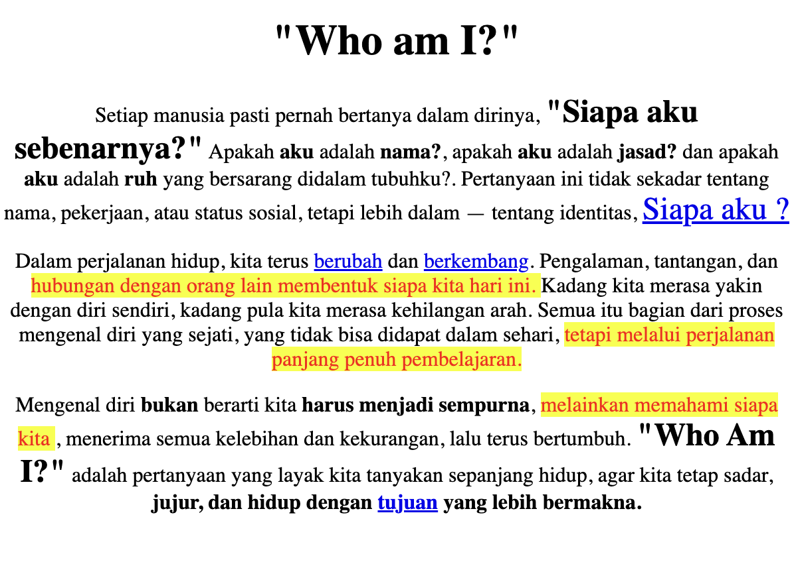

## CSS Example project

This repository contains a collection of simple HTML and CSS projects designed to document the basic elements of HTML structure. Each project has been developed with CSS styles implemented inline, in order to deepen the understanding of the basic concept of styling directly within HTML elements. The main goal of this project is to provide hands-on experience in using inline CSS as part of learning CSS in the beginning.

## Preview



## How to Run this project

1. Clone this project
```
git clone https://github.com/Dwaysetya/fgo24-html-basic.git
```
2. Enter the project firectory
```
cd directory-name
```
3. Install the Depedencies
```
npm install
```
4. run the project
```
npm run dev
```
5. Project will running on http://localhost:8080

## Depedencies

This project requires Node.js to run, so make sure Node.js is installed on your device.
- live-server: used to document an HTTP server locally, easing the development and testing process.

## Basic Information

This project was developed as part of the learning program at Kodacademy Bootcamp Batch 24, which was carried out by Dwi Setyabudi in order to deepen the understanding and technical skills acquired during the training.